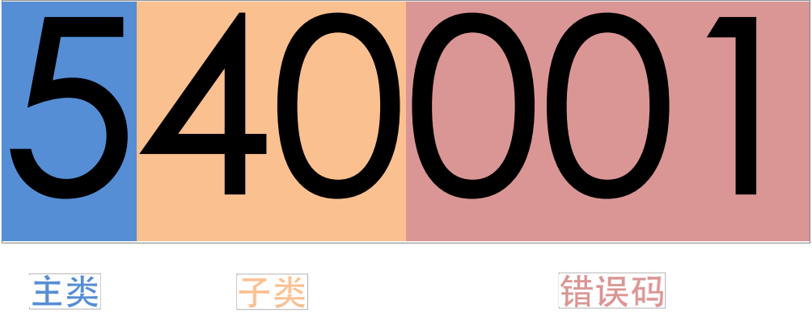

CurveAdm 错误码
===

简介
---

CurveAdm 错误码是 Curve 团队为了提高用户部署成功率、指导用户解决部署中可能出现的各类问题而设计的全局唯一的跟踪码。

```
---
Error-Code: 540000
Error-Description: port is already in use
Error-Clue: host=centos7-002, port=8202
How to Solve:
  * Website: https://github.com/opencurve/curveadm/wiki/errno#540000
  * Log: /root/.curveadm/logs/curveadm-2022-08-11_10-52-23.log
  * WeChat: opencurve_bot
```

错误码分类
---

错误码是一个 6 位固定长度的数字，每一个错误码由以下 3 部分组成：

 * 主类：
 * 子类：
 * 错误码：




### 主类

| 主类 | 类别说明 | 详细说明 | 通用解决方法  |
| :--- | :--- | :--- | :--- |
| 0 | | |
| 1 | **数据库**相关，如 SQLite 数据库初始化失败、执行 SQL 语句失败 |  |
| 2 | **命令行参数**相关， | |
| 3 | **配置文件**相关， | |
| 4 | | |
| 5 | **预检**相关 | |
| 6 | **命令执行**相关 | |
| 9 | 其他。 | |

### 子类

| 主类 | 主类说明 | 子类 | 子类说明 |
| :--- | :--- | :--- | :--- |
| `0`   | 初始化 | `0*` | |
| `1`   | 数据库 |`0*` | |
|     | |`1*` | |
| `2`     | 命令行参数 | `0*` | |
|      || `1*` | |
|      || `2*` | |
| `3`     | **配置文件** | `0*` | |
|      || `1*` | **CurveAdm 配置文件**相关，即 *~/.curveadm/curveadm.cfg* |
|      || `2*` | 主机配置文件相关，即 *hosts.yaml* |
|      || `3*` | 集群拓扑文件相关，即 *topology.yaml* |
|      || `4*` | 格式化配置文件相关，即 *format.yaml*|
|      || `5*` | 客户端配置文件相关，即 *client.yaml*|
| `4`    |  | `0*` | |
|      | | `1*` | |
|      | | `2*` | |
|      | | `3*` | |
|      | | `4*` | |
| `5`    | 预检 | `0*` | 拓扑文件预检项 *<topology\>* |
|      | | `1*` | SSH 预检项 *<ssh\>* |
|      | | `2*` | 权限预检项 *<permission\>* |
|      | | `3*` | 网络预检项 *<network\>* |
|      | | `4*` | 时间预先项 *<date>* |
| `6`    |  | `0*` | |
|     |  | `1*` | |
|     |  | `2*` | |
|     |  | `3*` | |
| `9` | 其他 | | |


错误码列表
---

* [100000](#100000)
* [100001](#100001)


## 100000

**类别：** [数据库](#数据库)、

**描述：** SQLite 数据库初始化失败

**如何解决：**
## 310000

**类别：** [配置文件][configure]、[CurveAdm 配置文件][curveadm]

**描述：**

**如何解决：**

## 311000

**类别：** [配置文件][configure]、[CurveAdm 配置文件][curveadm]

**描述：**

**如何解决：**


## 311001

**类别：** [配置文件][configure]、[curveadm 配置文件][curveadm]

**描述：** curveadm 配置文件中的日志等级配置项无效

**如何解决：** curveadm 的配置文件保存在安装，即  `~/.curveadm/curveadm.cfg`，关于用户安装目录，可参考[<curveadm 安装目录>](overview#安装目录)


`debug`、`info`、`warn`, `error`

示例：
```
[defaults]
log_level = info
sudo_alias = "sudo"
timeout = 180

[ssh_connections]
retries = 3
timeout = 10
```


## 320000

**类别：** [配置文件][configure]、[CurveAdm 配置文件][curveadm]

**描述：** CurveAdm 配置文件中的日志等级配置项无效

**如何解决：**


## 331000

**类别：** [配置文件][configure]、[拓扑文件][topology]

**描述：** 拓扑文件中的集群类型

**如何解决：**

```yaml
kind: curvebs
global:
  ...
```
## 331001

**类别：** [配置文件][configure]、[拓扑文件][topology]

**描述：** 拓扑文件中没有指定部署任何服务

**如何解决：**

## 331002

**类别：** [配置文件][configure]、[拓扑文件][topology]

**描述：**

**如何解决：**

## 331003

**类别：** [配置文件][configure]、[拓扑文件][topology]

**描述：** 复制服务配置项 `replicas` 要求为正整数

**如何解决：**

## 331003

**类别：** [配置文件][configure]、[拓扑文件][topology]

**描述：** 无效的变量区块

**如何解决：**

## 331004

**类别：** [配置文件][configure]、[拓扑文件][topology]

**描述：**

**如何解决：**

## 332000

**类别：** [配置文件][configure]、[拓扑文件][topology]

**描述：** 提交集群拓扑文件时，不允许在拓扑文件中删除服务

**如何解决：**

## 332001

**类别：** [配置文件][configure]、[拓扑文件][topology]

**描述：** 提交集群拓扑文件时，不允许在拓扑文件中增加服务

**如何解决：**

## 332002

**描述：** 扩容集群时，不允许在拓扑文件中删除服务

**如何解决：**

## 332003

**描述：**

**如何解决：**


## 340000

**类别：** [配置文件][configure]、[格式化配置文件][format]

**描述：** 格式化配置文件不存在

**如何解决：** 用户在格式化时可通过 `-f` 选项指定对应的格式化配置文件，若用户未指定，CurveAdm 默认会读取当前目录下的 `format.yaml` 文件，请确保对应的配置文件存在。用户可参考[<格式化磁盘>][格式化磁盘]文档来准备相应的格式化配置文件：

## 340001

**类别：** [配置文件][configure]、[格式化配置文件][format]

**描述：** 解析格式化配置文件失败（格式不符合要求）

**如何解决：** 请确保格式化配置文件格式符合要求，用户可根据错误码线索来修正格式，也可以参考[<格式化磁盘>][格式化磁盘]文档来准备相应的格式化配置文件

示例：

```yaml
host:
  - host1
  - host2
  - host3
disk:
  - /dev/sda:/data/chunkserver0:90  # device:mount_path:format_percent
  - /dev/sdb:/data/chunkserver1:90
  - /dev/sdc:/data/chunkserver2:90
```

## 341000

**类别：** [配置文件][configure]、[格式化配置文件][format]

**描述：** 格式化配置文件中的磁盘列表不符合规范

**如何解决：** 磁盘列表中的每一项由设备、挂载路径、格式化百分比这 3 部分组成，并由 `:` 符合间隔开，用户可根据错误线索锁定哪一项不符合规范并进行相应修正，也可以参考[<格式化磁盘>][格式化磁盘]文档来准备相应的格式化配置文件：

示例：
```yaml
host:
  - host1
  - host2
  - host3
disk:
  - /dev/sda:/data/chunkserver0      # 错误：缺少格式化百分比
  - /dev/sdb:/data/chunkserver1:     # 错误: 缺少格式化百分比
  - /dev/sdc:/data/chunkserver2:90:  # 错误: 多出一部分
  - /dev/sdd:/data/chunkserver3:90   # 正确
```

## 341001

**类别：** [配置文件][configure]、[格式化配置文件][format]

**描述：** 格式化配置文件中存在无效的设备名

**如何解决：** 磁盘列表中的每一项由设备、挂载路径、格式化百分比这 3 部分组成，并由 `:` 符合间隔开，其中的设备名必须为绝对路径，用户可根据错误线索锁定哪一项不符合规范并进行相应修正

示例：
```yaml
host:
  - host1
  - host2
  - host3
disk:
  - sda:/data/chunkserver0:90       # 错误：磁盘 sda 的设备名应为 /dev/sda
  - /dev/sdb:/data/chunkserver1:90  # 正确
  - /dev/sdc:/data/chunkserver2:90  # 正确
```

## 341002

**类别：** [配置文件][configure]、[格式化配置文件][format]

**描述：** 格式化配置文件中的挂载路径必须为绝对路径

**如何解决：** 磁盘列表中的每一项由设备、挂载路径、格式化百分比这 3 部分组成，并由 `:` 符合间隔开，其中的挂载路径必须为绝对路径，用户可根据错误线索锁定哪一项不符合规范并进行相应修正

示例：
```yaml
host:
  - host1
  - host2
  - host3
disk:
  - /dev/sda:chunkserver0:90        # 错误：挂载路径 chunkserver0 应为 /data/chunkserver0
  - /dev/sdb:/data/chunkserver1:90  # 正确
  - /dev/sdc:/data/chunkserver2:90  # 正确
```

## 341003

**类别：** [配置文件][configure]、[格式化配置文件][format]

**描述：** 格式化配置文件中的格式化百分比需为整数

**如何解决：** 磁盘列表中的每一项由设备、挂载路径、格式化百分比这 3 部分组成，并由 `:` 符合间隔开，其中的格式化百分比需为整数，用户可根据错误线索锁定哪一项不符合规范并进行相应修正

示例：
```yaml
host:
  - host1
  - host2
  - host3
disk:
  - /dev/sda:/data/chunkserver0:10.5  # 错误：10.5 为浮点
  - /dev/sdb:/data/chunkserver1:xyz   # 错误：xyz 不是整数
  - /dev/sdc:/data/chunkserver2:90    # 正确
```


## 341004

**类别：** [配置文件][configure]、[格式化配置文件][format]

**描述：** 格式化配置文件中的格式化百分比需在 **[1, 100]** 这个区间内

**如何解决：** 磁盘列表中的每一项由设备、挂载路径、格式化百分比这 3 部分组成，并由 `:` 符合间隔开，其中的格式化百分比需在 **[1, 100]** 这个区间内，用户可根据错误线索锁定哪一项不符合规范并进行相应修正

示例：
```yaml
host:
  - host1
  - host2
  - host3
disk:
  - /dev/sda:/data/chunkserver0:-1   # 错误：-1 不在 [1, 100] 区间内
  - /dev/sdb:/data/chunkserver1:101  # 错误：101 不在 [1, 100] 区间内
  - /dev/sdc:/data/chunkserver1:0    # 错误：0 不在 [1, 100] 区间内
  - /dev/sdd:/data/chunkserver2:1    # 正确
  - /dev/sde:/data/chunkserver3:100  # 正确
```

- [curveadm]: s
- [configure]: ss
- [topology]: ss
- [format]: ss
- [格式化磁盘]: curvebs-cluster-deployment#第-3-步格式化磁盘