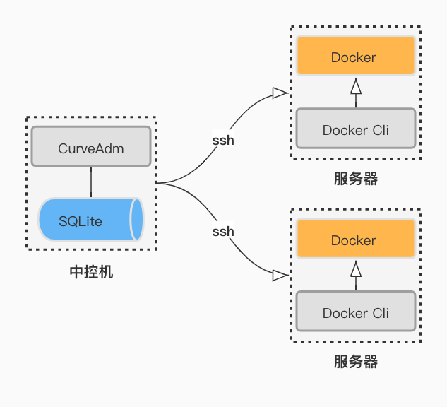

CurveAdm 简介
===

CurveAdm 是 [Curve][curve] 团队为提高系统易用性而设计的工具，其主要用于快速部署和运维 [CurveBS][curvebs]/[CurveFS][curvefs] 集群。

主要特性
===

* 快速部署 CurveBS/CurveFS 集群

  用户在准备好集群拓扑文件的情况下，可一键完成整个集群的部署。


* 容器化服务

  所有组件都运行在 Docker 容器内，解决各 Linux 发行版差异问题。


* 运维 CurveBS/CurveFS 集群

  支持常见的运维操作，并支持一键升级服务、扩缩容集群。


* 同时管理多个集群

  用户可同时管理多个不同类型（CurveBS/CurveFS）的集群，并可随时切换指定集群为当前管理集群（该设计灵感来源于 [git][git] 的分支管理）。


* 一键升级

  用户可一键将本地 CurveAdm 升级到最新版本，与当前最新版本保持一致。


* 错误精确定位

  我们为部署过程中出现的每一个错误分配了一个唯一的错误码，并针对每一个错误码给出了详细的解释，以及相关的解决方法。用户可通过[错误码列表][errno]页面在线查询相关错误码。


整体设计
===



安装目录
---

为实现多用户管理，CurveAdm 默认安装在当前用户主目录下的 `.curveadm` 目录，其所有文件都保存在该目录下，包括：

| 文件             | 说明                                                                                                        |
| :---             | :---                                                                                                        |
| bin/curveadm     | 二进制文件                                                                                                  |
| curveadm.cfg     | CurveAdm 配置文件，可配置日志等级、SSH 连接超时时间、sudo 权限等                                            |
| CHANGELOG        | 当前版本的更新日志                                                                                          |
| data/curveadm.db | [SQLite][sqlite] 数据库文件，所有持久化数据都保存在该文件中，包括集群名、集群拓扑、每个服务对应的容器 ID 等 |
| logs             | 日志目录，每执行一次命令都将会产生一个日志文件，并保存在该目录下                                            |
| temp             | 临时文件目录                                                                                                |

```shell
/home/curve/.curveadm
├── bin
│   └── curveadm
├── CHANGELOG
├── curveadm.cfg
├── data
│   └── curveadm.db
├── logs
│   ├── curveadm-2022-01-17_17-07-57.log
│   └── curveadm-2022-01-17_17-08-33.log
└── temp
```

数据存储
---

我们将 CurveAdm 中所有需要持久化的数据都保存在 SQLite 数据库中，
[SQLite][sqlite] 是一个自给自足的、无服务器的、零配置的、事务性的 SQL 数据库，
一个完整的 SQLite 数据库就是一个文件。

数据库中主要保存了以下 4 类数据：
  * 主机信息：包括各主机地址、SSH 端口、私钥路径等
  * 集群信息：包括集群名、集群 UUID、以及每个集群对应的拓扑等
  * 服务信息：服务 ID、服务对应的容器 ID
  * 客户端信息：客户端 ID，客户端对应的容器 ID

> :bulb: **提示：**
>
>  服务 ID 是根据集群拓扑生成的，在集群拓扑给定的情况下，我们会根据固定的规则为拓扑中的每一个服务生成一个唯一的 ID，即服务 ID 也是固定的。
>
>  根据服务 ID，在数据库中就可以查询到对应的容器 ID，而主机模块又保存了每个服务部署的主机 Host、SSH 私钥路径等信息，通过这些信息，我们就可以对服务对应的容器进行管理了。

服务管理
---

为解决组件运行依赖问题，CurveBS/CurveFS 中的所有组件都运行在 Docker 容器内，我们将每个版本的全部组件、依赖、必要工具都打包进了同一个镜像，并发布至 Dcoker 公共仓库。

CurveAdm 通过 SSH 客户端连接到远端服务器，执行相关部署或管理命令，以及通过 Docker 客户端 [Docker Cli][docker-cli] 来管理服务容器。

[curve]: https://github.com/opencurve/curve
[curvebs]: https://github.com/opencurve/curve
[curvefs]: https://github.com/opencurve/curve/tree/master/curvefs
[git]: https://git-scm.com/
[errno]: https://github.com/opencurve/curveadm/wiki/errno
[sqlite]: https://www.sqlite.org/index.html
[docker-cli]: https://docs.docker.com/engine/reference/commandline/cli/