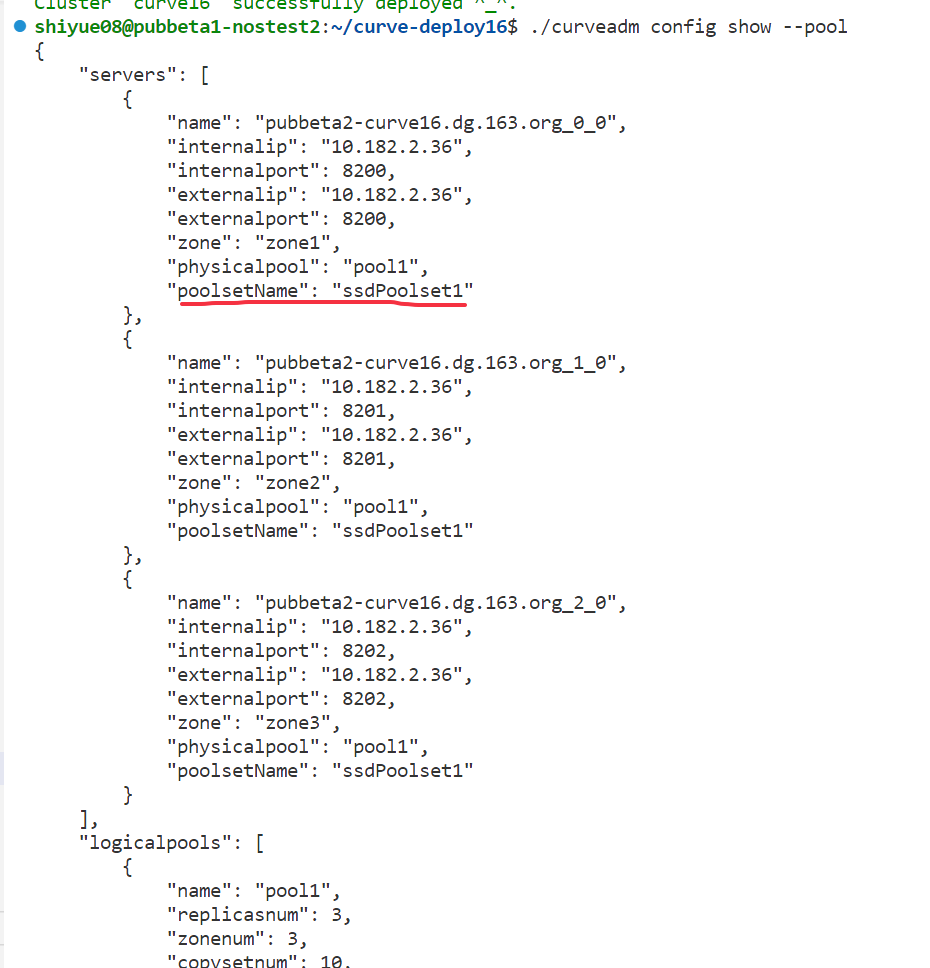
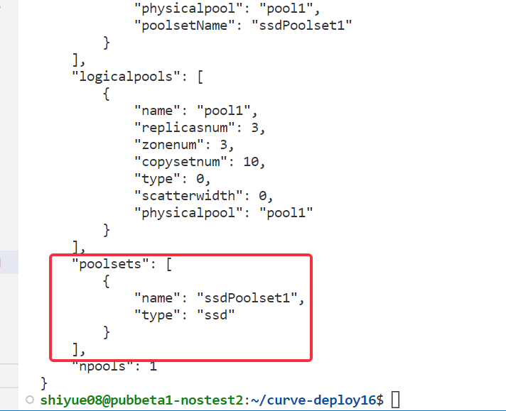
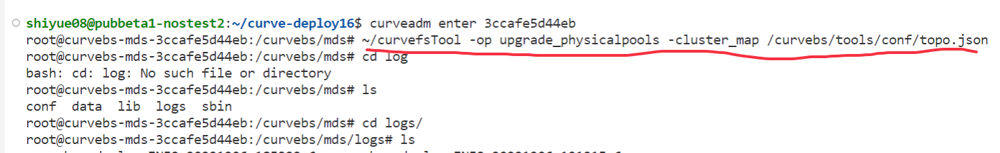
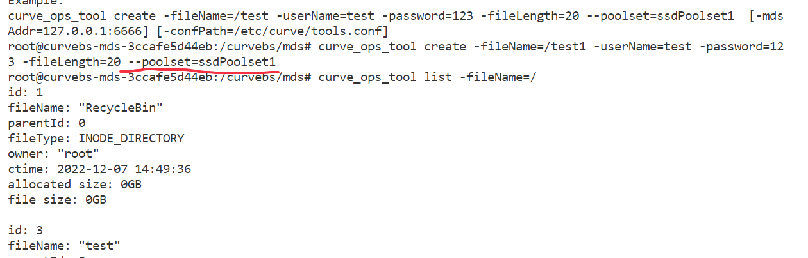
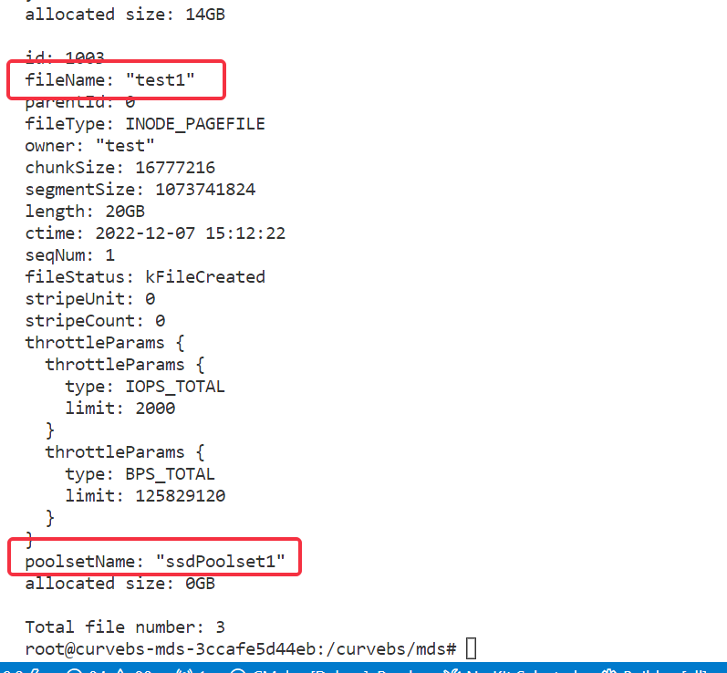

# 一、升级旧集群结构

step1：在升级之前保存旧集群的topo.json文件，一般存放在在容器里的curvebs/tools/conf路径下,或者执行curveadm config show --pool命令查看集群结构然后复制保存到一个json文件中。

step2: 升级镜像文件，将旧镜像文件里mds部分替换为新镜像里的mds代码

1.修改topology.yaml文件中的镜像名为含poolset版本的镜像名：

```
kind: curvebs
global:
  container_image: opencurvedocker/curvebs:poolset # 修改镜像
```

2.升级指定服务（mds)

```
curveadm upgrade --role mds
```

（升级镜像教程：https://github.com/opencurve/curveadm/wiki/upgrade-curve）


step3: 升级之后进入容器

将curve/tools下的curvefsTool文件编译成二进制之后拷贝进容器中，下图的例子中存放在~目录下

将旧集群的topo.json文件修改成新集群的结构， 如下图（增加一个poolsets层级，添加需要创建的poolset信息，每个server里添加一个poolsetName字段）并拷贝进容器，记住文件的路径







然后在容器里执行下图中的命令即可完成集群结构升级




命令执行过后没有报错，再使用curve_ops_tool工具的create命令创建一个卷指定poolset看是否成功，创建成功，即集群升级成功




创建成功之后可以用 curve_ops_tool list -fileName= /命令查看文件信息，检查文件是否分配到了指定的poolset里，如下图


