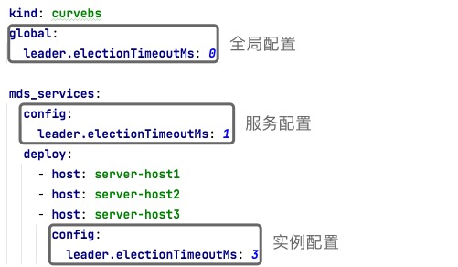

集群拓扑文件
===

* [简介](#简介)
* [示例](#示例)
* [特性](#特性)
  * [层级](#层级)
  * [变量](#变量)
  * [replicas](#replicas)
* [CurveBS 集群拓扑](#curvebs-集群拓扑)
* [CurveFS 集群拓扑](#curvefs-集群拓扑)

简介
---

集群拓扑文件用来描述哪些服务部署在哪些机器上，以及每一个服务实例的配置。

示例
---

```yaml
kind: curvefs
global:
  container_image: opencurvedocker/curvefs:latest
  data_dir: /home/curve/curvefs/data/${service_role}
  log_dir: /home/curve/curvefs/logs/${service_role}

etcd_services:
  config:
    listen.ip: ${service_host}
    listen.port: 2380
    listen.client_port: 2379
  deploy:
    - host: server-host1
    - host: server-host2
    - host: server-host3

mds_services:
  config:
    listen.ip: ${service_host}
    listen.port: 6700
    listen.dummy_port: 7700
  deploy:
    - host: server-host1
    - host: server-host2
    - host: server-host3

metaserver_services:
  config:
    listen.ip: ${service_host}
    listen.port: 6800
    metaserver.loglevel: 0
  deploy:
    - host: server-host1
    - host: server-host2
    - host: server-host3
      config:
        metaserver.loglevel: 3
```

特性
---

为使拓扑文件配置更灵活、更精简，我们给拓扑文件添加了以下几个特性：

* [层级](#层级)
* [变量](#变量)
* [replica](#replica)

### 层级

拓扑文件中的配置分为以下 3 个层级：
  * 全局配置：作用于拓扑文件中的全部服务实例
  * 服务配置：作用于同角色下的所有服务实例
  * 实例配置：作用于单一服务实例

配置优先级为：`实例配置` > `服务配置` > `全局配置`。



#### 示例：使用配置层级简化拓扑文件

以下是 2 个不同的配置文件，但是其具备相同的配置效果：

```yaml
mds_services:
  config:
  deploy:
    - host: server-host1
      config:
        leader.electionTimeoutMs: 3
    - host: server-host2
      config:
        leader.electionTimeoutMs: 3
    - host: server-host3
      config:
        leader.electionTimeoutMs: 3
```

```yaml
mds_services:
  config:
    leader.electionTimeoutMs: 3
  deploy:
    - host: server-host1
    - host: server-host2
    - host: server-host3
```

### 变量

为减少重复配置、精简拓扑文件，我们内置了以下变量，
这些变量在不同的上下文中具备不同的值，可用于拓扑文件配置的填写：

| 变量名                         | 说明                                                                                                                                                                                                                                        | 示例                                                        |
| :---                           | :---                                                                                                                                                                                                                                        | :---                                                        |
| `${service_host}`              | 服务主机地址。在不同的主机上部署服务时该变量具备不同的值，如在主机 `server-host1` 上部署服务时，该变量值为主机 `server-host1` 对应的地址，即 `10.0.1.1`，在主机 `server-host2` 上部署服务时，则该变量值为 `10.0.1.2`，详见[主机模块](hosts) | `10.0.1.1`                                                  |
| `${service_role}`              | 服务角色名。在部署不同类型的服务时，具备不同的角色名，如在部署 etcd 服务时，该变量值为 etcd，而在部署 mds 服务时，则该变量值为 mds                                                                                                          | `etcd`、`mds`、`chunkserver`、`snapshotclone`、`metaserver` |
| `${service_host_sequence}`     | 服务主机序列号。部署同类型服务时，根据 `deploy` 列表，在第一台主机上部署服务时，该序列号为 0，在第二台主机上部署服务时，该序列号为 1，依此类推                                                                                              | `0`、`1`、`2`                                               |
| `${service_replicas_sequence}` | 服务副本序列号。在将同一类型的服务在同一主机上部署多个副本实例时，部署第一个副本时，该序列号为 0，部署第二个副本时，该序列号为 1，依此类推                                                                                                  | `0`、`1`、`2`                                               |
| `${format_replicas_sequence}`  | 格式化后的服务副本序列号。其值等同于 `${service_replicas_sequence}` 变量，但是该序列号加了前置 0                                                                                                                                            | `00`、`01`、`02`                                            |
| `${random_uuid}`               | 随机 UUID                                                                                                                                                                                                                                   | `6fa8f01c411d7655d0354125c36847bb`                          |

当前，除了内置变量外，用户也可以自定义变量, 在 `variable` 区块添加相应变量即可：

```yaml
global:
  variable:
    var1: value1
    var2: value2
```

下面我们将通过 3 个示例来展示变量的应用，在每个示例中都有 2 份不同的配置，但是其都具备相同的配置效果：

> 我们假定 server-host{1,2,3} 对应的地址分别为 10.0.1.{1,2,3}，并已通过[主机模块][hosts]提交

#### 示例 1：在每台主机上部署一个 etcd 实例

```shell
etcd_services:
  config:
  deploy:
    - host: server-host1
      config:
        listen.ip: 10.0.1.1
    - host: server-host2
      config:
        listen.ip: 10.0.1.2
    - host: serevr-host3
      config:
        listen.ip: 10.0.1.3
```

```yaml
etcd_services:
  config:
    listen.ip: ${service_host}
  deploy:
    - host: server-host1
    - host: server-host2
    - host: server-host3
```

#### 示例 2：在同一台主机上部署多个 chunkserver 实例

```yaml
chunkserver_services:
  config:
    listen.ip: 10.0.1.1
  deploy:
    - host: serevr-host1
      config:
        listen.port: 8200
    - host: serevr-host2
      config:
        listen.port: 8201
    - host: server-host3
      config:
        listen.port: 8202
```

```yaml
chunkserver_services:
  config:
    listen.ip: 10.0.1.1
    listen.port: 820${service_host_sequence}
  deploy:
    - host: serevr-host1
    - host: serevr-host2
    - host: serevr-host3
```

#### 示例 3：自定义变量

```yaml
etcd_services:
  deploy:
   - host: server-host1
   - host: server-host2
   - host: server-host3

mds_services:
 deploy:
   - host: server-host1
   - host: server-host2
   - host: server-host3
```

```yaml
global:
  variable:
    machine1: server-host1
    machine2: server-host2
    machine3: server-host3

etcd_services:
  deploy:
    - host: ${machine1}
    - host: ${machine2}
    - host: ${machine3}

mds_services:
  deploy:
    - host: ${machine1}
    - host: ${machine2}
    - host: ${machine3}
```

### replicas

当我们需要在单台机器上部署多个同一类型的服务实例时，可利用 `replicas` 复制服务特性来简化我们的拓扑文件：

```yaml
chunkserver_services:
  config:
    listen.port: 820${service_host_sequence}
  deploy:
    - host: server-host1
    - host: server-host1
    - host: server-host1
```

```yaml
chunkserver_services:
  config:
    listen.port: 820${service_replicas_sequence}
  deploy:
    - host: server-host1
      replicas: 3
```

变量 `${servicce_host_sequence}`、`${service_replicas_sequence}` 的值请参考上文[变量](#变量)。

CurveBS 集群拓扑
---

CurveBS 集群拓扑文件由以下 5 个区块组成：

| 区块                   | 说明                   | 服务简介                                                                                           |
| :---                   | :---                   | :---                                                                                               |
| global                 | 全局配置               |                                                                                                    |
| etcd_services          | etcd 服务区块          | 用于存储元数据                                                                                     |
| mds_services           | mds 服务区块           | 中心节点。负责元数据管理、集群状态收集与调度，详见 [mds 设计][curvebs-mds-design]                  |
| chunkserver_services   | chunkserver 服务区块   | 数据节点。对外提供数据 I/O 和节点管理功能接口，详见 [chunkserver 设计][curvebs-chunkserver-design] |
| snapshotclone_services | snapshotclone 服务区块 | 快照克隆服务。详见[快照克隆服务设计][curvebs-snapshotclone-design]                                 |

### 示例

```yaml
kind: curvebs
global:
  container_image: opencurvedocker/curvebs:v1.2
  log_dir: ${home}/logs/${service_role}${service_replicas_sequence}
  data_dir: ${home}/data/${service_role}${service_replicas_sequence}
  s3.ak: <>
  s3.sk: <>
  s3.nos_address: <>
  s3.snapshot_bucket_name: <>
  variable:
    home: /tmp
    machine1: server-host1
    machine2: server-host2
    machine3: server-host3

etcd_services:
  config:
    listen.ip: ${service_host}
    listen.port: 2380
    listen.client_port: 2379
  deploy:
    - host: ${machine1}
    - host: ${machine2}
    - host: ${machine3}

mds_services:
  config:
    listen.ip: ${service_host}
    listen.port: 6700
    listen.dummy_port: 7700
  deploy:
    - host: ${machine1}
    - host: ${machine2}
    - host: ${machine3}

chunkserver_services:
  config:
    listen.ip: ${service_host}
    listen.port: 82${format_replica_sequence}  # 8200, 8201, 8202
    data_dir: /data/chunkserver${service_replicas_sequence}  # /data/chunkserver0, /data/chunksever1, /data/chunkserver2
    copysets: 100
  deploy:
    - host: ${machine1}
      replica: 3
    - host: ${machine2}
      replica: 3
    - host: ${machine3}
      replica: 3

snapshotclone_services:
  config:
    listen.ip: ${service_host}
    listen.port: 5555
    listen.dummy_port: 8081
    listen.proxy_port: 8080
  deploy:
    - host: ${machine1}
    - host: ${machine2}
    - host: ${machine3}
```

为了方便用户准备拓扑文件，我们根据常见的场景，给用户准备了不同的拓扑文件模板。
用户可根据需求自行选择，并进行编辑调整：

* [单机部署][curvebs-stand-alone-topology]

  所有服务都运行在一台主机上，一般用于体验或测试

* [多机部署][curvebs-cluster-topology]

  通用的多机部署模板，可用于生产环境或测试

> :bulb: **提醒：**
>
> 关于拓扑文件中的配置层级及变量，详见上文：
> * [层级](#层级)
> * [变量](#变量)

### CurveBS 重要配置项

| 配置项                  | 是否必填 | 默认值                       | 说明                                                                                                                                                                                                                 |
| :---                    | :---     | :---                         | :---                                                                                                                                                                                                                 |
| kind                    | Y        |                              | 拓扑文件类型。必须为 `curvebs`                                                                                                                                                                                       |
| container_image         |          | opencurvedocker/curvebs:v1.2 | 容器镜像。默认值为我们最新稳定版本，你也可以访问 [CurveBS 公共 docker 仓库][curvebs-dockerhub]自行选择                                                                                                               |
| report_usage            |          | true                         | 是否匿名上报用户集群使用量。开启该选项后，curveadm 会匿名上报用户集群 UUID 以及集群使用量，来帮助 curve 团队更好地了解用户及改进服务                                                                                 |
| log_dir                 |          |                              | 保存服务日志的目录。如果不配置该选项，日志默认保存在容器内的指定目录，一旦容器被清理，日志将会随之删除                                                                                                               |
| data_dir                | Y        |                              | 保存服务数据的目录。如果不配置该选项，数据默认保存在容器内的指定目录，一旦容器被清理，数据将会随之丢失。特别地，针对 chunkserver 服务，请将数据目录配置为 chunkfile pool 目录，详见[格式化磁盘][curvebs-format-disk] |
| s3.ak                   | Y        |                              | S3 服务的 Access Key。用于上传快照                                                                                                                                                                                   |
| s3.sk                   | Y        |                              | S3 服务的 Secret Key。用于上传快照                                                                                                                                                                                   |
| s3.nos_address          | Y        |                              | S3 服务地址。用于上传快照                                                                                                                                                                                            |
| s3.snapshot_bucket_name | Y        |                              | S3 服务桶名。用于上传快照                                                                                                                                                                                            |
| copysets                |          | 100                          | 每个 chunkserver 服务上保存的 copyset 数量                                                                                                                                                                           |
| variable                |          |                              | 变量区块。可将自定义变量填写在该区块                                                                                                                                                                                 |

所有未在拓扑文件上出现的配置项，我们都将使用默认配置值，你可以通过点击以下连接来查看各服务配置项及相关默认值：

* [etcd.conf][curvebs-etcd-conf]
* [mds.conf][curvebs-mds-conf]
* [chunkserver.conf][curvebs-chunkserver-conf]
* [snapshotclone.conf][curvebs-snapshotclone-conf]

> :bulb: **提醒：**
>
> CurveAdm 默认会收集集群使用量来帮助 Curve 团队更好地了解用户是如何使用它的，
> 它会通过匿名的方式上报集群 UUID、集群类型以及集群使用量，完整的代码保存在[这里][report-script]。
>
> 你也可以通过编辑拓扑文件来关闭它：
> ```yaml
> global:
>   report_usage: false
> ```


CurveFS 集群拓扑
---

CurveFS 集群拓扑文件由以下 4 个区块组成：

| 区块                | 说明                | 服务简介                                                                                                                |
| :---                | :---                | :---                                                                                                                    |
| global              | 全局配置            |                                                                                                                         |
| etcd_services       | etcd 服务区块       | 用于存储元数据                                                                                                          |
| mds_services        | mds 服务区块        | 元数据管理服务。 CurveFS 的 MDS 类似于 CurveBS 的 [MDS][curvebs-mds-design]，元数据管理服务，提供中心化的元数据管理服务 |
| metaserver_services | metaserver 服务区块 | 分布式元数据管理系统。为客户端提供元数据服务                                                                            |

### 示例

```yaml
kind: curvefs
global:
  container_image: opencurvedocker/curvefs:latest
  log_dir: ${home}/curvefs/logs/${service_role}
  data_dir: ${home}/curvefs/data/${service_role}
  variable:
    home: /tmp
    machine1: server-host1
    machine2: server-host2
    machine3: server-host3

etcd_services:
  config:
    listen.ip: ${service_host}
    listen.port: 2380
    listen.client_port: 2379
  deploy:
    - host: ${machine1}
    - host: ${machine2}
    - host: ${machine3}

mds_services:
  config:
    listen.ip: ${service_host}
    listen.port: 6700
    listen.dummy_port: 7700
  deploy:
    - host: ${machine1}
    - host: ${machine2}
    - host: ${machine3}

metaserver_services:
  config:
    listen.ip: ${service_host}
    listen.port: 6800
    listen.external_port: 7800
    metaserver.loglevel: 0
  deploy:
    - host: ${machine1}
    - host: ${machine2}
    - host: ${machine3}
      config:
        metaserver.loglevel: 3
```

为了方便用户准备拓扑文件，我们根据常见的场景，给用户准备了不同的拓扑文件模板。
用户可根据需求自行选择，并进行编辑调整：

* [单机部署][curvefs-stand-alone-topology]

  所有服务都运行在一台主机上，一般用于体验或测试

* [多机部署][curvefs-cluster-topology]

  通用的多机部署模板，可用于生产环境或测试

> :bulb: **提醒：**
>
> 关于拓扑文件中的配置层级及变量，详见上文：
> * [层级](#层级)
> * [变量](#变量)

### CurveFS 重要配置项

| 配置项           | 是否必填 | 默认值                         | 说明                                                                                                                                 |
| :---             | :---     | :---                           | :---                                                                                                                                 |
| kind             | Y        |                                | 拓扑文件类型。必须为 `curvefs`                                                                                                       |
| container_image  |          | opencurvedocker/curvefs:latest | 容器镜像。默认值为我们最新稳定版本，你也可以访问 [CurveFS 公共 docker 仓库][curvefs-dockerhub]自行选择                               |
| report_usage     |          | true                           | 是否匿名上报用户集群使用量。开启该选项后，curveadm 会匿名上报用户集群 UUID 以及集群使用量，来帮助 curve 团队更好的了解用户及改进服务 |
| log_dir          |          |                                | 保存服务日志的目录。如果不配置该选项，日志默认保存在容器内的指定目录，一旦容器被清理，日志将会随之删除                               |
| data_dir         |          |                                | 保存服务数据的目录。如果不配置该选项，数据默认保存在容器内的指定目录，一旦容器被清理，数据将会随之丢失                               |
| s3.ak            |          |                                | S3 服务的 Access Key。用于上传实际数据。仅在使用S3存储引擎并且创建文件系统时需要                                                                                               |
| s3.sk            |          |                                | S3 服务的 Secret Key。用于上传实际数据。仅在使用S3存储引擎并且创建文件系统时需要                                                                                               |
| s3.endpoint      |          |                                | S3 服务地址。用于上传实际数据。仅在使用S3存储引擎并且创建文件系统时需要                                                                                                        |
| s3.bucket_name   |          |                                | S3 服务桶名。用于上传实际数据。仅在使用S3存储引擎并且创建文件系统时需要                                                                                                        |
| variable         |          |                                | 变量区块。可将自定义变量填写在该区块                                                                                                 |

所有未在拓扑文件上出现的配置项，我们都将使用默认配置值，你可以通过点击以下连接来查看各服务配置项及相关默认值：

* [etcd.conf][curvefs-etcd-conf]
* [mds.conf][curvefs-mds-conf]
* [metaserver.conf][curvefs-metaserver-conf]

> :bulb: **提醒：**
>
> CurveAdm 默认会收集集群使用量来帮助 Curve 团队更好地了解用户是如何使用它的，
> 它会通过匿名的方式上报集群 UUID、集群类型以及集群使用量，完整的代码保存在[这里][report-script]。
>
> 你也可以通过编辑拓扑文件来关闭它：
> ```yaml
> global:
>   report_usage: false
> ```

[hosts]: https://github.com/opencurve/curveadm/wiki/hosts
[curvebs-mds-design]: https://github.com/opencurve/curve/blob/master/docs/cn/mds.md
[curvebs-chunkserver-design]: https://github.com/opencurve/curve/blob/master/docs/cn/chunkserver_design.md
[curvebs-snapshotclone-design]: https://github.com/opencurve/curve/blob/master/docs/cn/snapshotcloneserver.md
[curvebs-stand-alone-topology]: https://github.com/opencurve/curveadm/blob/master/configs/bs/stand-alone/topology.yaml
[curvebs-cluster-topology]: https://github.com/opencurve/curveadm/blob/master/configs/bs/cluster/topology.yaml
[curvebs-dockerhub]: https://hub.docker.com/repository/docker/opencurvedocker/curvebs
[curvebs-format-disk]: https://github.com/opencurve/curveadm/wiki/curvebs-cluster-deployment#第-3-步格式化磁盘
[curvebs-etcd-conf]: https://github.com/opencurve/curve/blob/master/conf/etcd.conf
[curvebs-mds-conf]: https://github.com/opencurve/curve/blob/master/conf/mds.conf
[curvebs-chunkserver-conf]: https://github.com/opencurve/curve/blob/master/conf/chunkserver.conf
[curvebs-snapshotclone-conf]: https://github.com/opencurve/curve/blob/master/conf/snapshot_clone_server.conf
[curvefs-stand-alone-topology]: https://github.com/opencurve/curveadm/blob/master/configs/fs/stand-alone/topology.yaml
[curvefs-cluster-topology]: https://github.com/opencurve/curveadm/blob/master/configs/fs/cluster/topology.yaml
[curvefs-dockerhub]: https://hub.docker.com/repository/docker/opencurvedocker/curvefs
[curvefs-etcd-conf]: https://github.com/opencurve/curve/blob/master/curvefs/conf/etcd.conf
[curvefs-mds-conf]: https://github.com/opencurve/curve/blob/master/curvefs/conf/mds.conf
[curvefs-metaserver-conf]: https://github.com/opencurve/curve/blob/master/curvefs/conf/metaserver.conf
[report-script]: https://github.com/opencurve/curveadm/blob/master/internal/task/scripts/report.go
